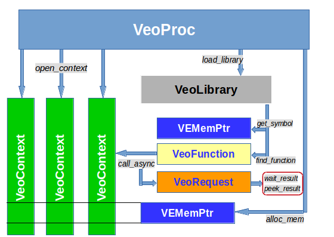

# PyVEO: Python bindings to VEO

This package provides python bindings to VEO: Vector Engine Offloading.

## Introduction

The NEC Aurora Tsubasa Vector Engine (VE) is a very high memory
bandwidth vector processor with HBM2 memory in the form-factor of a
PCIe card. Currently up to eight VE cards can be inserted into a
vector host (VH) which is typically a x86_64 server.

The primary usage model of the VE is as a standalone computer which
uses the VH for offloading its operating system functionality. Each VE
card behaves like a separate computer with its own instance of
operating system (VEOS), it runs native VE programs compiled for the
vector CPU that are able to communicate with other VEs through MPI.

A second usage model of VEs lets native VE programs offload
functionality to the VH with the help of the VHcall mechanisms. The VH
is used by the VE as an accelerator for functions it is better suited
for, like unvectorizable code.

The third usage model is the classical accelerator model with a main
program compiled for the VH running high speed program kernels on the
VE. A mechanism for this usage model is the VE Offloading (VEO)
library provided by the veofload and veoffload-veorun RPMs.

This Python module is an implementation of the VEO API for Python
programs. It is an extension to the C API and exposes the mechanisms
through Python objects.


## Python VEO API

**Overview**




### VeoProc

A `VeoProc` object corresponds to one running instance of the `veorun`
VE program that controls one address space on the VE. The command
```python
from veo import *

proc = VeoProc(nodeid)
```
creates a VEO process instance on the VE node `nodeid`. By default `VeoProc()`
starts `/opt/nec/ve/libexec/veorun`. It can be replaced by an own version with
statically linked libraries by pointing the environment variable **VEORUN_BIN**
to it.

**Methods:**
- `load_library(libname)` loads a `.so` dynamically linked shared object
fileinto the VEOProc address space. It returns a `VeoLibrary` object.
- `static_library()` returns a `VeoLibrary` object exposing the symbols
and functions statically linked with the running `veorun`-instance of
this `VeoProc`.
- `alloc_mem(size_t size)` allocates a memory buffer of size *size* on
the VE and returns a `VEMemPtr` object that points to it.
- `free_mem(VEMemPtr memptr)` frees the VE memory pointed to by the
`VEMemPtr` argument.
- `read_mem(dst, VEMemPtr src, size_t size)` read memory from
the VE memory buffer that *src* points to into the *dst* object transfering
*size* bytes. The *dst* python object must support the buffer protocol.
- `write_mem(VEMemPtr dst, src, size_t size)` write *size* bytes
from the *src* object to the VE memory buffer pointed to by the *dst*
VEMemPtr. The *src* object must support the buffer protocol.
- `open_context()` opens a worker thread context on the VE.
- `close_context(VeoContext ctx)` closes a context on the VE.
- `get_function(name)` searches for the function *name* in the `VeoFunction`
cache of each `VeoLibrary` object of the current `VeoProc` and returns the
`VeoFunction` object. A VE function appears in a library's cache only if it
was looked up before with the `find_library()` method of the `VeoLibrary` object.

**Attributes:**
- `nodeid` is the VE node ID on which the `VeoProc` is running.
- `context` is a list with the contexts active in the current `VeoProc` instance.
- `lib` is a dict of the `VeoLibrary` objects loaded into the `VeoProc`.


### VeoCtxt

VE Offloading thread context that corresponds to one VE worker
thread. Technically it is cloned from the control thread started
by the VeoProc therefore all VeoCtxt instances share the same
memory and are controlled by their parent *VeoProc*.

Each VE context has two queues, a command queue and a completion
queue. Calling an offloaded VE function creates a request on the
command queue, when the request is finished the result is added to the
completion queue.

**Methods:**
- `async_read_mem(dst, VEMemPtr src, size_t size)` queue a request to
read memory from the VE memory buffer that *src* points to into the
*dst* object transfering *size* bytes. The *dst* python object must
support the buffer protocol.
- `async_write_mem(VEMemPtr dst, src, size_t size)` queue a request to
write *size* bytes from the *src* object to the VE memory buffer
pointed to by the *dst* VEMemPtr. The *src* object must support the
buffer protocol.

**Attributes:**
- `proc`: the *VeoProc* to which the context belongs.

TODO: expose the PID/TID of a VeoCtxt such that we can pin it to certain cores.


### VeoLibrary

Functions that need to be called on the VE must be loaded into the
*VeoProc* by loading a shared library .so file into the process
running on the VE. This is done by calling the `load_library()` method
of the *VeoProc* instance. The result is an instance of the
*VeoLibrary* class.

Example:
```python
import os

lib = proc.load_library(os.getcwd() + "/libvetest.so")
```

A special instance of *VeoLibrary* is the "static" library, that
represents the functions and symbols statically linked with the
*veorun* VE program that has been started by the *VeoProc*
instance. It does not need to be loaded but can be accessed by the
method `static_library()`.
```python
slib = proc.static_library()
```

The static library feature only needs to be used when the offloaded
functions can not be linked dynamically or cannot be compiled with
`-fpic`, for example because some of the libraries it uses is not
available as dynamic library.

**Methods:**
- `get_symbol(name)`: find a symbol's address in the *VeoLibrary* and return it as a *VEMemPtr*.
- `find_function(name)`: find a function in the current library and return it as an instance of *VeoFunction*.

**Attributes:**
- `name`: the name of the library, actually the full path from which it was loaded. The "static" library has the name `__static__`.
- `proc`: the *VeoProc* instance to which the library belongs.
- `func`: a `dict` containing all functions that were 'found' in the current library. The values are the corresponding *VeoFunction* instances.
- `symbol`: a `dict` containing all symbols and their *VEMemPtr* that were searched and found in the current library.


### VeoFunction

Offloaded functions located inside *VeoLibrary* objects are
represented by instances of the *VeoFunction* class. This object
logically "belongs" to the *VeoLibrary* in which the function was
located by calling the `find_function()` method. The object contains
the address of the function in the VE address space of the *VeoProc*
process. If you have multiple processes that you use (for example
because you use multiple VE cards on the same hosts), the function
needs to be located in each of them, and you will need to handle
multiple instances of *VeoFunction*, one for each *VeoProc*.

Once "found" in a library, the *VeoFunction* instance is added to the
`func` dict of the *VeoLibrary* with the function name as key. The
method `get_function()` of *VeoProc* can search the function name
inside the *VeoLibrary* hashes of all libraries loaded into the
process.

**Methods:**
- `args_type(*args)`: sets the data types for the arguments of the function. The arguments must contain strings describing the base data types: "char", "short", "int", "long", "float", "double", preceeded by "unsigned" if needed, ending with a "*" if the data types represent pointers. "void *" is a valid data type as an argument. Arrays are not allowed. Structs should not be passed by value, only by reference.
- `ret_type(rettype)`: specify the data type of the return value as a string. Same restrictions as for arguments apply. "void" is a valid return type.
- `__call__(VeoCtxt ctx, *args)`: the call method allows to asynchronously offload a function call to the VE. `ctx` specifies a *VeoContext* in which the function should be called, `*args` are the arguments of the function, corresponding to the prototype set with the `args_type()` method. The `__call__` method allows one to use an instance of the class as if it were a function. It returns a *VeoRequest* object.

**Attributes:**
- `lib`: the *VeoLibrary* object to which the function belongs.
- `name`: the name of the function inside the VE process.
- `_args_type`: the argument types string list.
- `_ret_type`: the return value type string.

The *__call__* method supports a special kind of argument: an instance
of the class *OnStack*. The object `OnStack(buff, size)` will result
in the buffer *buff* of size *size* being copied over onto the VE
stack and behave like a temporary variable of the calling
function. The corresponding argument will point to the address on the
stack. Currently only arguments with intent "IN" are supported,
i.e. they should only be read by the callee. They are lost after the
VE function finishes and are overwritten by the following VEO function
call.

**Notes:**

The arguments to a function must fit into a 64 bit
register. It is possible to pass values (char, int, long, float,
double) or pointers to memory locations inside the VE process. When
passing something like a struct, the value of the struct must be
transfered to VE memory separately, before calling the function, and
the corresponding argument should point to that memory location.

A maximum of 32 arguments to a function call are supported. When the
number of arguments doesn't exceed 8, the arguments are passed in
registers. For more than 8 arguments the values are passed on stack.

Calling a function is asynchronous. The function and its arguments are
queued in the command queue of the *VeoContext*.


### VeoRequest

Each call to a *VeoFunction* returns a *VeoRequest* which helps track
the status of the offloaded function call and retrieve its result.

**Methods:**
- `wait_result()`: wait until the request has been completed. Returns the result, converted to the data type as specified with the *VeoFunction* `ret_type()` method. Raises an `ArithmeticError` if the function raised an exception, and a `RuntimeError` if the execution failed in another way.
- `peek_result()`: immediately returns after checking whether the request was completed or not. If the request was completed, it returns the result, like `wait_result()`. If the command did not finish, yet, it returns a `NameError` exception. The other error cases are the same as for `wait_result()`.

**Attributes:**
- `req`: the internal request ID inside the *VeoCtxt* command queue.
- `ctx`: the *VeoCtxt* context this request belongs to.


### VEMemPtr

A *VEMemPtr* object represents a pointer to a memory location on the
VE, inside a *VeoProc* process. It can be created by allocating memory
inside a *VeoProc* process, finding a symbol inside a *VeoLibrary*, or
simply instantiating a VEMemPtr when the VE address is known.

Example:
```python
ve_buff = proc.alloc_mem(10000)

table = lib.get_symbol("table_inside_library")
```

**Attributes:**
- `addr`: the memory location within the processes' VE virtual address space.
- `size`: the size of the memory object. This is only know if the *VEMemPtr* was created by `alloc_mem()`. It is useful for debugging, has no function otherwise.
- `proc`: the *VeoProc* instance to which the memory belongs.


### Hooks

Whenever a *VeoProc* object is created it will check for the existence
of init hooks and call them at the end of the initialisation of the
*VeoProc* object. Functions that are registered and called as an init
hook must take one single argument: the *VeoProc* object. The are
registered by calling *set_proc_init_hook()*:
```python
from veo import set_proc_init_hook

def init_function(proc):
    # do something that needs to be done automatically
    # for each proc instance
    #...

set_proc_init_hook(init_function)
```

A practical use for the init hooks is the registration of the VE BLAS functions in *py-vecblas*:
```python
from veo import set_proc_init_hook

def _init_cblas_funcs(p):
    lib = p.static_library()
    for k, v in _cblas_proto.items():
        f = lib.find_function(k)
        if f is not None:
            fargs = v["args"]
            f.args_type(*fargs)
            f.ret_type(v["ret"])

set_proc_init_hook(_init_cblas_funcs)
```

The registration of the VE BLAS functions needs to be done for every
instance of *VeoProc* because each of the instances must find and
register its own set of *VeoFunction*s. By registering the init hook
the user will not need to load a library and find a function for each
of the started *VeoProc* processes, i.e. for each of the VE cards in
the system.

## Build & Install

