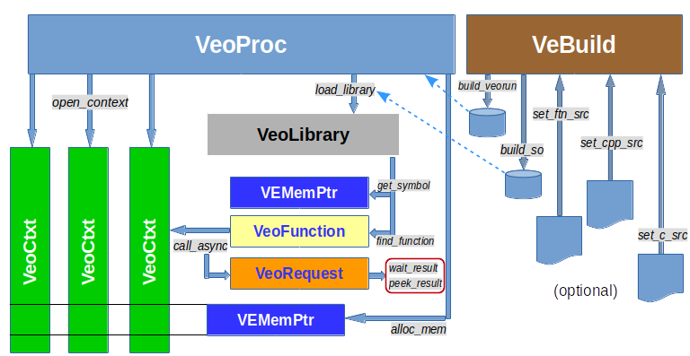

# PyVEO: Python bindings to VEO

This package provides python bindings to VEO: Vector Engine Offloading.

## Introduction

The NEC Aurora Tsubasa Vector Engine (VE) is a very high memory
bandwidth vector processor with HBM2 memory in the form-factor of a
PCIe card. Currently up to eight VE cards can be inserted into a
vector host (VH) which is typically a x86_64 server.

The primary usage model of the VE is as a standalone computer which
uses the VH for offloading its operating system functionality. Each VE
card behaves like a separate computer with its own instance of
operating system (VEOS), it runs native VE programs compiled for the
vector CPU that are able to communicate with other VEs through MPI.

A second usage model of VEs lets native VE programs offload
functionality to the VH with the help of the VHcall mechanisms. The VH
is used by the VE as an accelerator for functions it is better suited
for, like unvectorizable code.

The third usage model is the classical accelerator model with a main
program compiled for the VH running high speed program kernels on the
VE. A mechanism for this usage model is the VE Offloading (VEO)
library provided by the veofload and veoffload-veorun RPMs.

This Python module is an implementation of the VEO API for Python
programs. It is an extension to the C API and exposes the mechanisms
through Python objects.


## Python VEO API

**Overview**



The Python classes are depicted as boxes (VeoProc, VeoLibrary,
VeBuild, ...), some of their methods are labeling arrows that lead to
new classes. The following sections document the classes, their
methods and attributes.


### VeoProc

A `VeoProc` object corresponds to one running instance of the `veorun`
VE program that controls one address space on the VE. The command
```python
from veo import *

proc = VeoProc(nodeid)
```
creates a VEO process instance on the VE node `nodeid`. By default `VeoProc()`
starts `/opt/nec/ve/libexec/veorun`. It can be replaced by an own version with
statically linked libraries by pointing the environment variable **VEORUN_BIN**
to it.

Starting with VEO version 1.3.2 a statically linked *veorun* can also be specified
as an argument when calling *veo_proc_create_static()*. This new VEO API call
was implemented into the *VepProc* *__init()* method, which can now take the
statically compiled veorun binaries path as an additional argument:
```python
from veo import *

proc = VeoProc(nodeid, veorun_bin_path)
```
This change is available at and after the **v1.3.3** tag of *py-veo*.


**Methods:**
- `load_library(libname)` loads a `.so` dynamically linked shared object
fileinto the VEOProc address space. It returns a `VeoLibrary` object.
- `static_library()` returns a `VeoLibrary` object exposing the symbols
and functions statically linked with the running `veorun`-instance of
this `VeoProc`.
- `alloc_mem(size_t size)` allocates a memory buffer of size *size* on
the VE and returns a `VEMemPtr` object that points to it.
- `free_mem(VEMemPtr memptr)` frees the VE memory pointed to by the
`VEMemPtr` argument.
- `read_mem(dst, VEMemPtr src, size_t size)` read memory from
the VE memory buffer that *src* points to into the *dst* object transfering
*size* bytes. The *dst* python object must support the buffer protocol.
- `write_mem(VEMemPtr dst, src, size_t size)` write *size* bytes
from the *src* object to the VE memory buffer pointed to by the *dst*
VEMemPtr. The *src* object must support the buffer protocol.
- `open_context()` opens a worker thread context on the VE.
- `close_context(VeoContext ctx)` closes a context on the VE.
- `get_function(name)` searches for the function *name* in the `VeoFunction`
cache of each `VeoLibrary` object of the current `VeoProc` and returns the
`VeoFunction` object. A VE function appears in a library's cache only if it
was looked up before with the `find_library()` method of the `VeoLibrary` object.

**Attributes:**
- `nodeid` is the VE node ID on which the `VeoProc` is running.
- `context` is a list with the contexts active in the current `VeoProc` instance.
- `lib` is a dict of the `VeoLibrary` objects loaded into the `VeoProc`.


### VeoCtxt

VE Offloading thread context that corresponds to one VE worker
thread. Technically it is cloned from the control thread started
by the VeoProc therefore all VeoCtxt instances share the same
memory and are controlled by their parent *VeoProc*.

Each VE context has two queues, a command queue and a completion
queue. Calling an offloaded VE function creates a request on the
command queue, when the request is finished the result is added to the
completion queue.

**Methods:**
- `async_read_mem(dst, VEMemPtr src, size_t size)` queue a request to
read memory from the VE memory buffer that *src* points to into the
*dst* object transfering *size* bytes. The *dst* python object must
support the buffer protocol.
- `async_write_mem(VEMemPtr dst, src, size_t size)` queue a request to
write *size* bytes from the *src* object to the VE memory buffer
pointed to by the *dst* VEMemPtr. The *src* object must support the
buffer protocol.

**Attributes:**
- `proc`: the *VeoProc* to which the context belongs.

TODO: expose the PID/TID of a VeoCtxt such that we can pin it to certain cores.


### VeoLibrary

Functions that need to be called on the VE must be loaded into the
*VeoProc* by loading a shared library .so file into the process
running on the VE. This is done by calling the `load_library()` method
of the *VeoProc* instance. The result is an instance of the
*VeoLibrary* class.

Example:
```python
import os

lib = proc.load_library(os.getcwd() + "/libvetest.so")
```

A special instance of *VeoLibrary* is the "static" library, that
represents the functions and symbols statically linked with the
*veorun* VE program that has been started by the *VeoProc*
instance. It does not need to be loaded but can be accessed by the
method `static_library()`.
```python
slib = proc.static_library()
```

The static library feature only needs to be used when the offloaded
functions can not be linked dynamically or cannot be compiled with
`-fpic`, for example because some of the libraries it uses is not
available as dynamic library.

**Methods:**
- `get_symbol(name)`: find a symbol's address in the *VeoLibrary* and return it as a *VEMemPtr*.
- `find_function(name)`: find a function in the current library and return it as an instance of *VeoFunction*.

Unknown attributes of a *VeoLibrary* object are treated like functions
that are implicitly searched with the *find_function()*. The search is
only done once and the *VeoFunction* object is cached inside the
object in the *func* dict (see below). If the function is not found an
exception will be raised. This means that a function *foo* inside a
library object *lib* can be simply addressed as `lib.foo`.


**Attributes:**
- `name`: the name of the library, actually the full path from which it was loaded. The "static" library has the name `__static__`.
- `proc`: the *VeoProc* instance to which the library belongs.
- `func`: a `dict` containing all functions that were 'found' in the current library. The values are the corresponding *VeoFunction* instances.
- `symbol`: a `dict` containing all symbols and their *VEMemPtr* that were searched and found in the current library.


### VeoFunction

Offloaded functions located inside *VeoLibrary* objects are
represented by instances of the *VeoFunction* class. This object
logically "belongs" to the *VeoLibrary* in which the function was
located by calling the `find_function()` method. The object contains
the address of the function in the VE address space of the *VeoProc*
process. If you have multiple processes that you use (for example
because you use multiple VE cards on the same hosts), the function
needs to be located in each of them, and you will need to handle
multiple instances of *VeoFunction*, one for each *VeoProc*.

Once "found" in a library, the *VeoFunction* instance is added to the
`func` dict of the *VeoLibrary* with the function name as key. The
method `get_function()` of *VeoProc* can search the function name
inside the *VeoLibrary* hashes of all libraries loaded into the
process.

**Methods:**
- `args_type(*args)`: sets the data types for the arguments of the function. The arguments must contain strings describing the base data types: "char", "short", "int", "long", "float", "double", preceeded by "unsigned" if needed, ending with a "*" if the data types represent pointers. "void *" is a valid data type as an argument. Arrays are not allowed. Structs should not be passed by value, only by reference.
- `ret_type(rettype)`: specify the data type of the return value as a string. Same restrictions as for arguments apply. "void" is a valid return type.
- `__call__(VeoCtxt ctx, *args)`: the call method allows to asynchronously offload a function call to the VE. `ctx` specifies a *VeoContext* in which the function should be called, `*args` are the arguments of the function, corresponding to the prototype set with the `args_type()` method. The `__call__` method allows one to use an instance of the class as if it were a function. It returns a *VeoRequest* object.

**Attributes:**
- `lib`: the *VeoLibrary* object to which the function belongs.
- `name`: the name of the function inside the VE process.
- `_args_type`: the argument types string list.
- `_ret_type`: the return value type string.

The *__call__* method supports a special kind of argument: an instance
of the class *OnStack*. The object `OnStack(buff, size)` will result
in the buffer *buff* of size *size* being copied over onto the VE
stack and behave like a temporary variable of the calling
function. The corresponding argument will point to the address on the
stack. Currently only arguments with intent "IN" are supported,
i.e. they should only be read by the callee. They are lost after the
VE function finishes and are overwritten by the following VEO function
call.

**Notes:**

The arguments to a function must fit into a 64 bit
register. It is possible to pass values (char, int, long, float,
double) or pointers to memory locations inside the VE process. When
passing something like a struct, the value of the struct must be
transfered to VE memory separately, before calling the function, and
the corresponding argument should point to that memory location.

A maximum of 32 arguments to a function call are supported. When the
number of arguments doesn't exceed 8, the arguments are passed in
registers. For more than 8 arguments the values are passed on stack.

Calling a function is asynchronous. The function and its arguments are
queued in the command queue of the *VeoContext*.


### OnStack

With *OnStack* it is possible to pass in and out arguments that need
to be accessed by reference. Python objects that support the buffer
interface are supported as arguments of *OnStack*. The initialization
syntax is:
```py
OnStack(buff, [size=...], [inout=...])
```
with the arguments:
- `buff`: is a python object that supports the buffer interface and is contiguous in memory.
- `size`: can limit the size of the transfer. If not specified, the size of the buffer is used.
- `inout`: the scope of the transfer, can be `VEO_INTENT_IN`, `VEO_INTENT_OUT` or `VEO_INTENT_INOUT`.

With *VEO_INTENT_IN* the Python *buff* object's buffer is copied onto
the VE stack right before calling the VE kernel. With *VEO_INTENT_OUT*
the buffer is not copied in but copied out from the VE's stack into
the Python object's buffer after the VE kernel has finished
execution. *VEO_INTENT_INOUT* obviously copies data in before
execution and out after.


### VeoRequest

Each call to a *VeoFunction* returns a *VeoRequest* which helps track
the status of the offloaded function call and retrieve its result.

**Methods:**
- `wait_result()`: wait until the request has been completed. Returns the result, converted to the data type as specified with the *VeoFunction* `ret_type()` method. Raises an `ArithmeticError` if the function raised an exception, and a `RuntimeError` if the execution failed in another way.
- `peek_result()`: immediately returns after checking whether the request was completed or not. If the request was completed, it returns the result, like `wait_result()`. If the command did not finish, yet, it returns a `NameError` exception. The other error cases are the same as for `wait_result()`.

**Attributes:**
- `req`: the internal request ID inside the *VeoCtxt* command queue.
- `ctx`: the *VeoCtxt* context this request belongs to.


### VEMemPtr

A *VEMemPtr* object represents a pointer to a memory location on the
VE, inside a *VeoProc* process. It can be created by allocating memory
inside a *VeoProc* process, finding a symbol inside a *VeoLibrary*, or
simply instantiating a VEMemPtr when the VE address is known.

Example:
```python
ve_buff = proc.alloc_mem(10000)

table = lib.get_symbol("table_inside_library")
```

**Attributes:**
- `addr`: the memory location within the processes' VE virtual address space.
- `size`: the size of the memory object. This is only know if the *VEMemPtr* was created by `alloc_mem()`. It is useful for debugging, has no function otherwise.
- `proc`: the *VeoProc* instance to which the memory belongs.


### VeBuild

A `VeBuild` object provides simple wrapper functionality around
SX-Aurora compilation and linking of VE code into either a dynamically
shared object usable as a loadable *VeoLibrary*, or a statically
linked *veorun* that includes the VE kernels. It also allows to inline
C, C++, Fortran code into the Python program, and compile it from
within the Python program. This way interactive examples of using the
VE for offloading can be completely contained within a Python program
eg. inside a Jupyter or iPython notebook.

It is necessary to store the VEO kernels on disk and load them from
there because VEO can not load kernels from memory, yet.

`VeBuild` is very simple code that still has some flaws regarding the
error handling and returns little information when errors occur. It is
really meant for small experiments, not for serious code development.

**Methods:**
- `set_c_src(label, content, [flags=...], [compiler=...])`: set a C source code module labeled by *label*. The method accepts following arguments:
  - *label*: a string with a name for this source code block. The source code block's content will end up in a file called <*label*>.c.
  - *content*: a raw string with the C code for this source block.
  - *flags*: optional named parameter with override flags for the compilation of this source code block. Must contain `-fpic`!
  - *compiler*: optional named parameter which overrides the default *ncc* C compiler for this source code block.
- `set_cpp_src(label, content, [flags], [compiler])`: same as *set_c_src()* for C++ code.
- `set_ftn_src(label, content, [flags], [compiler])`: same as *set_c_src()* for Fortran code.
- `set_build_dir(dirname)`: set the directory in which the source blocks will be copied into files, the object files will be compiled and the *.so* and *veorun* files will be stored.
- `build_so([label], [flags=...], [libs=[...]], [linker=...], [verbose=True])`: build a dynamically shared object from all registered source code blocks. Each source code block will be compiled as a separate object file and they will be linked together. The method returns the name of the `.so` file, if successful, *None* otherwise. This can raise exceptions!
  - *label*: an optional name for the `.so` file. If not specified, the name will be set to that of the first source block's label.
  - *flags*: a string with override flags for linking the `.so` file.
  - *libs*: a Python array with further libraries of objects to be linked. The strings will be added to the linker command.
  - *linker*: a string overriding the linker that is detected by the build command.
  - *verbose*: a boolean activating verbose output of comilation commands and their output. The default value is *False*.
- `build_veorun([label], [flags=...], [libs=[...]], [verbose=True])`: build a *veorun* executable from the registered source code blocks. This executable can be used to create a *VeoProc* instance. The options are identical to those of *build_so()*. The method uses the *mk_veorun_static* command from the *veoffload-veorun* package. The command returns the name of the *veorun* executable if successful.
- `clean()`: remove the source code and object files which were written during the compilation. The *.so* and *veorun* files are not deleted.
- `clear()`: remove the internally stored source code blocks.
- `realclean()`: calls the *clean()* method and removes all written *.so* and *veorun* files. Also remove the build directories that were created. A call to *realclean()* followed by a call to *clear()* initializes the *VeBuild* object and removes most of the things it created.

A source code block can be replaced or updated by calling the
*set_XYZ_src()* method again with the same label.

When building a shared object or a statically linked *veorun* file the
source code blocks will be written into source files named after their
labels, in the current working directory. Make sure you don't
overwrite anything! These source files are compiled into objects files
(also in the current directory) and linked together into the `.so`
 or the *veorun* file.

**NOTE:** When using the tripple quotes """, always prepend them by
'r' (r""") such that the content is interpreted as raw
string. Otherwise the escaped characters will be interpreted and spoil
the source code.

Example:
```python
from veo import *

bld = VeBuild()

# first c source module is a function summing up a vector
bld.set_c_source("_test", r"""
double mysum(double *a, int n)
{
  int i; double sum;
  for (i = 0; i < n; i++)
    sum += a[i];
  return sum;
}
""")

# build the _test.so library in the current directory
veo_name = bld.build_so(verbose=True)

# remove temporary source and object code, keep the .so file
bld.clean()

# and now the VEO part
p = VeoProc(0)
lib = p.load_library(os.getcwd() + "/" + veo_name)
lib.mysum.args_type("double *", "int")
lib.mysum.ret_type("double")

```


### Hooks

Whenever a *VeoProc* object is created it will check for the existence
of init hooks and call them at the end of the initialisation of the
*VeoProc* object. Functions that are registered and called as an init
hook must take one single argument: the *VeoProc* object. The are
registered by calling *set_proc_init_hook()*:
```python
from veo import set_proc_init_hook

def init_function(proc):
    # do something that needs to be done automatically
    # for each proc instance
    #...

set_proc_init_hook(init_function)
```

A practical use for the init hooks is the registration of the VE BLAS functions in *py-vecblas*:
```python
from veo import set_proc_init_hook

def _init_cblas_funcs(p):
    lib = p.static_library()
    for k, v in _cblas_proto.items():
        f = lib.find_function(k)
        if f is not None:
            fargs = v["args"]
            f.args_type(*fargs)
            f.ret_type(v["ret"])

set_proc_init_hook(_init_cblas_funcs)
```

The registration of the VE BLAS functions needs to be done for every
instance of *VeoProc* because each of the instances must find and
register its own set of *VeoFunction*s. By registering the init hook
the user will not need to load a library and find a function for each
of the started *VeoProc* processes, i.e. for each of the VE cards in
the system.


## Build & Install

The easiest way to install is from PYPI / The Cheese Factory:
```sh
pip install --upgrade py-veo
```

Prebuilt RPM packages are normally published in the github repository
[releases](https://github.com/SX-Aurora/py-veo/releases).

Bulding from GIT requires *cython* and *numpy*. I prefer to do it from
inside a virtualenv, but this is a matter of taste. Inside a
virtualenv only build the SRPM, do build the RPMs outside, otherwise
the paths to Python will be messed up and point inside the virtualenv.

Clone the repository from github:
```sh
git clone https://github.com/SX-Aurora/py-veo.git
cd py-veo
```

For a quick test:
```sh
make

# try the examples
cd examples
make
```

For building RPMs:
```sh
make srpm

# this step needs to be done outside a virtualenv!
rpmbuild --rebuild *.src.rpm
```
